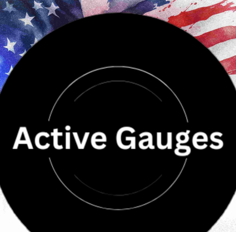

<p>
  
</p>

# 🏍️ AG Gauges  

**AG Gauges** is an ambitious Flutter-powered project designed for riders and drivers who crave real-time data and sleek visuals.  
Currently under active development, this project blends embedded systems with mobile tech for a fully immersive dashboard experience.

---

## 🚀 Project Vision  
To build a **next-gen active gauge system** that keeps you in the loop with your ride’s dynamics — whether you're carving corners or tearing down the straightaways.

---

## 🎯 Key Features & Goals

- 📊 **Real-Time Roll Angle Display**  
  Create an eye-catching UI (using **LVGL**) to display the **current roll angle** of your vehicle — initially targeting **motorcycles**.
  
- 🖥️ **Embedded Display Integration**  
  Develop a hardware gauge with an LED screen powered by a dev board to act as a live, responsive Active Gauge.

- 📈 **Data Collection**  
  Capture key performance metrics:
  - Roll Angle
  - Vehicles Speed
  - Lateral G-Force
  - Longitudinal G-Force

- ⚡ **Real-Time Data Updates**  
  Ensure smooth, live updates on the gauge for instant feedback during your ride.

- 📡 **Bluetooth Low Energy (BLE) Connectivity**  
  Wirelessly transmit data to a mobile app for storage, analysis, and replay.

- 🎨 **Customizable Gauge Interface**  
  Enable users to personalize their gauge design directly from the mobile app — because every ride deserves its own style.

---

## 🏗️ Project Status  
> **In Development** — Expect sparks, rewires, and plenty of code magic ahead.

---

## 🧰 Tools & Tech Stack
- **Flutter** (Mobile app)
- **LVGL** (Embedded UI)
- **ESP32 / Dev Board**
- **BLE (Bluetooth Low Energy)**

---

## 📂 Project Setup (for Personal Reference)
```bash
flutter pub get
flutter run